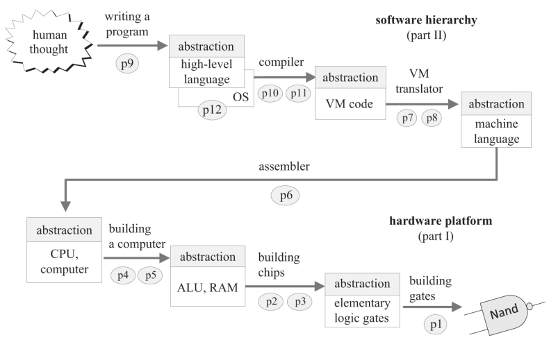

# Nand2Tetris



Platform: Fedora Linux 36 (Workstation Edition) with GNOME Wayland

Java (OpenJDK): `sudo dnf install java-17-openjdk-17.0.3.0.7-1.fc36.x86_64`

Create symbolic links for the software tools:
````
$ mkdir ~/bin
$ cd ~/bin
$ ln -s ~/nand2tetris/tools/HardwareSimulator.sh HardwareSimulator
$ chmod +x HardwareSimulator
$ ln -s ~/nand2tetris/tools/CPUEmulator.sh CPUEmulator
$ chmod +x CPUEmulator
$ ln -s ~/nand2tetris/tools/VMEmulator.sh VMEmulator
$ chmod +x VMEmulator
$ ln -s ~/nand2tetris/tools/Assembler.sh Assembler
$ chmod +x Assembler
$ ln -s ~/nand2tetris/tools/JackCompiler.sh JackCompiler
$ chmod +x JackCompiler
````

The Hack computer is based on Harvard architecture (two separate address spaces), unlike most multi-purpose computers based on von Neumann architecture (single address space for storing both programs and data).

The Jack language is based on Java (statically-typed object-oriented with two-tier compilation) but the compiler is written in Python (dynamically-typed interpreted). Even though both Java and Python generate bytecode, they are [quite different](https://stackoverflow.com/a/1732383/6687333). I used the function and variable names (`mixedCase`) given in the textbook instead of [following the Python conventions](https://peps.python.org/pep-0008/#function-and-variable-names) (`lower_case_with_underscores`).
